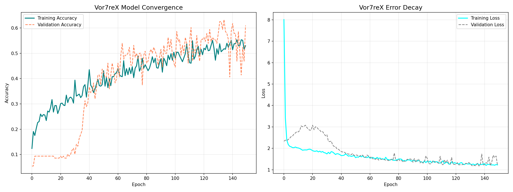
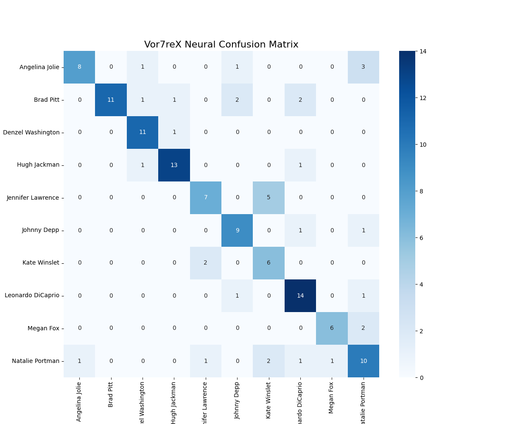

# Vor7reX: Deep Facial Recognition System <a href="https://pokemondb.net/pokedex/reshiram"></a><a href="https://pokemondb.net/pokedex/zekrom"></a>

**Vor7reX** is a multiclass facial recognition system based on **Convolutional Neural Networks (CNNs)**. The project implements an end-to-end Computer Vision pipeline: from biometric data acquisition and pre-processing, to statistical validation, up to real-time inference.

## Theoretical Notes & Architecture
The Vor7reX architecture was engineered to solve the multiclass identity classification task in uncontrolled environments. The goal is to transform raw data into digital identities through a computationally efficient structure.


### Model Anatomy (Computational Schema Reference):
* **Input Tensor ($i_1 \times i_2 \times d_1$)**: Spatial matrix sized at 128x128x1 (grayscale). Represents the raw normalized biometric data prior to feature extraction.
* **Convolutional Blocks (Feature Extractors)**: Architecture structured across three depth levels (32, 64, 128 filters). Shallow layers isolate low-frequency features (edges, gradients), while deep layers encode complex facial topology (specific somatic traits).
* **Flatten Layer**: Topological transformation flattening two-dimensional feature maps into a dense one-dimensional tensor, necessary to feed the final classifier.
* **Fully-Connected (Dense Layer)**: Multi-Layer Perceptron (MLP) level delegated to logical inference. The 10 output neurons (corresponding to target classes) compute the probability distribution via Softmax activation to determine the winning identity.

### Custom Architecture Specifications:
* **Deep CNN Stack**: Implementation of 3 convolutional blocks with increasing filter density (32 -> 64 -> 128) for hierarchical extraction of facial features.
* **Batch Normalization**: Applied systematically post-convolution to standardize activations, mitigate internal covariate shift, and accelerate gradient convergence.
* **Regularization Layer (Dropout)**: Strategic use of Dropout (up to 0.5) in the Fully-Connected classifier to penalize overfitting. This forces the network to abstract resilient geometric patterns rather than memorizing individual pixel noise.
* **Data Augmentation**: Stochastic generation of samples (rotation, zoom, flip) integrated into the training flow to increase the model's spatial invariance to pose variations.

<br><br>

## Development Process & Fine-Tuning

### 1. Biometric Preprocessing and Spatial Normalization
To ensure input data relevance, a face detection system based on **Haar Cascades** was implemented. 
* The facial ROI (Region of Interest) is isolated, converted to grayscale, and resized to **128x128**. 
* This step eliminates chromatic noise (irrelevant for facial morphology) and standardizes tensor dimensionality, optimizing computational load.

### 2. Visual Optimization: CLAHE Algorithm
To mitigate lighting artifacts and typical screen glare, the system integrates a **CLAHE** (Contrast Limited Adaptive Histogram Equalization) filter. 
* Operating locally (on grid regions), CLAHE maximizes the contrast of micro-somatic traits (eyes, nasal septum) even under overexposure or strong lighting asymmetry.

### 3. Numerical Integrity: 1/255 Normalization
During data ingestion, pixel tensors undergo linear scaling into the `[0, 1]` range. 
* This normalization prevents gradient saturation and **ReLU** activation explosion, ensuring numerical stability during backpropagation.

<br><br>

## 📊 Performance Analysis
The model achieved a consolidated validation accuracy of **72.48%** across 10 distinct classes.

### Training Telemetry
Comparative analysis: initial baseline converging at 60% accuracy.

*Accuracy and Loss curves confirm stable asymptotic convergence, certifying the model's ability to generalize biometric patterns while neutralizing overfitting.*

### Confusion Matrix (Deep Diagnostics)
Analytical validation on the latest optimized model (72.48%):

Offline inference reveals that:
* **True Positives (High Confidence)**: Targets like *Hugh Jackman* and *Jennifer Lawrence* hit a near-absolute classification rate.
* **Biometric Challenges (False Positives Mitigation)**: The system correctly identifies structural overlaps between similar targets (e.g., Angelina Jolie vs Natalie Portman). The live stream error margin is handled via a confidence Threshold hyper-parameterized at **0.5**.

<br><br>

## Repository Architecture
File system mapping and data flow management:

* **`pictures/`**: Data management core.
    * **`raw/`**: Storage for original unstructured samples.
    * **`dataset/`**: Training data lake containing pre-processed samples (128x128, grayscale).
* **`pick_face.py`**: ETL and pre-processing module. Scans `raw/`, isolates ROIs via Haar Cascades, and populates `dataset/`.
* **`read_data.py`**: Data loader responsible for class mapping and input tensor vectorization.
* **`train_model.py`**: Core engine. Instantiates the CNN topology, executes the optimization loop, and compiles post-training telemetry.
* **`test_model.py`**: Offline statistical evaluation module (Precision, Recall, F1-Score, and Confusion Matrix).
* **`camera_reader.py`**: Live inference module. Interfaces with the hardware layer (webcam), applies CLAHE processing, and runs real-time feed-forward on the model.
* **`model_vor7rex.h5`**: Serialized neural network; includes architectural topology and optimized weights, ready for deployment.

<br><br>

## Environment Setup
To replicate this environment and run the pipeline, ensure you have Python 3.8+ installed. Install the required deep learning and computer vision dependencies:

```bash
pip install tensorflow opencv-python numpy matplotlib scikit-learn
```

## Usage Guide

### 1. Extraction and Normalization
Execute the data ingestion pipeline from raw samples:
```bash
python pick_face.py
```

### 2. Model Training
Runs the training cycle on the data collection, applying Data Augmentation and saving the best model obtained:

```bash
python train_model.py
```

### 3. Offline Validation and Diagnostics
This step is crucial to analyze the model's true precision on unseen data. Generates the detailed statistical report and Confusion Matrix:

```bash
python test_model.py
```
### 4. Real-Time Monitor
Launch the live recognition module for the final test via webcam inference:

```bash
python camera_reader.py
```
<br><br>

## Future Scope
The current architecture has proven highly resilient on a restricted dataset. The next engineering phase involves:

* **Massive Dataset Integration**: Scaling the training pipeline using large-scale public datasets (e.g., *Labeled Faces in the Wild - LFW*) to benchmark the CNN's capacity limit and push the accuracy metric beyond 90%.
* **Live Optimizer Tuning**: Further optimization of real-time inference using TensorFlow Lite for edge-device deployment to improve performance on mobile and IoT hardware.

<br><br>

## Conclusions

Vor7reX represents the practical implementation of Computer Vision applied to biometric security. The system balances computational aggressiveness and efficiency, ensuring real-time processing and robust accuracy even on consumer architectures.

---

<div align="left">
<p valign="middle">
Created by <b>Vor7reX</b>
<a href="https://pokemondb.net/pokedex/gengar">

</a>
</p>
</div>
